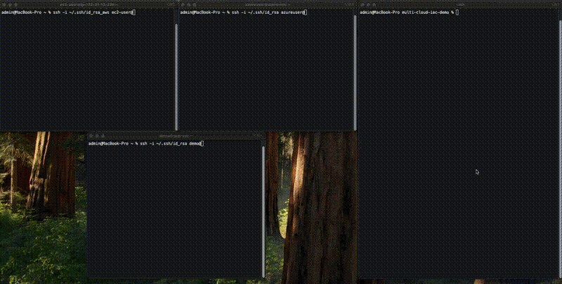

# Multi-Cloud IaC Demo

## Overview
This project demonstrates the use of Infrastructure as Code (IaC) to provision and manage resources across three major cloud providers: AWS, Azure, and Google Cloud. The demo involves spinning up virtual machines (VMs) on each provider with basic networking enabled for inter-cloud communication (ping/ICMP). This highlights the power and speed of Terraform for utilizing multi-cloud provisioning, while ensuring resources are easily manageable and secure, serving as a single source of truth.

---

## Demo


---

## Prerequisites

1. **Cloud Accounts**:
   - AWS: [Sign up](https://aws.amazon.com/free/)
   - Azure: [Sign up](https://azure.microsoft.com/free/)
   - Google Cloud: [Sign up](https://cloud.google.com/free)

2. **CLI Tools** (Install via Homebrew):
   - AWS CLI: `brew install awscli`
   - Azure CLI: `brew install azure-cli`
   - Google Cloud SDK: `brew install --cask google-cloud-sdk`
   - Terraform: `brew install terraform`

3. **Development Tools**:
   - A text editor or IDE (e.g., Visual Studio Code).
   - Git for version control: `brew install git`.

4. **Required Credentials**:
   - **AWS**: Access Key ID and Secret Access Key.
   - **Azure**: Service Principal credentials (Client ID, Tenant ID, Secret, and Subscription ID).
   - **GCP**: Service Account JSON key file.

---

## Project Structure

```plaintext
multi-cloud-iac-demo/
├── .gitignore           # Excludes sensitive files (e.g., state, keys)
├── README.md            # Project documentation
├── providers.tf         # Terraform provider configurations
├── variables.tf         # Variable definitions
├── terraform.tfvars     # Actual variable values (keys, regions, etc.)
├── main.tf              # Main Terraform configuration for resources
└── outputs.tf           # Outputs such as VM IP addresses
```

---

## Setup Instructions

### 1. Enable Necessary Services

- **AWS**:
  - Enable EC2, IAM, and optionally VPC.
- **Azure**:
  - Enable Virtual Machines, Virtual Network, and optionally Resource Groups.
- **Google Cloud**:
  - Enable Compute Engine API.

### 2. Retrieve Access Credentials

- **AWS**:
  1. Go to the AWS Management Console.
  2. Navigate to **IAM > Users** and create an access key.
  3. Note the Access Key ID and Secret Access Key.
- **Azure**:
  1. Create a Service Principal for Terraform:
     ```bash
     az ad sp create-for-rbac --name terraform-user --role Contributor --scopes /subscriptions/<subscription-id>
     ```
  2. Note the output credentials: App ID (Client ID), Tenant ID, and Secret.
- **GCP**:
  1. Go to the IAM & Admin section of the GCP Console.
  2. Create a Service Account and download the JSON key.

### 3. Log In to CLI Tools

- **AWS**:
  ```bash
  aws configure
  ```
- **Azure**:
  ```bash
  az login
  ```
- **Google Cloud**:
  ```bash
  gcloud auth login
  ```

### 4. Add Credentials to Terraform

- Update **`terraform.tfvars`** with the following values that match your environment:

```hcl
# AWS
aws_region = "us-east-2"

# Azure
azure_ssh_public_key  = "~/.ssh/id_rsa.pub"

# GCP
gcp_project_id        = "project-d-12345"
gcp_credentials_file  = "/Users/userdemo/gcp-terraform-key.json"
```

---

## Workflow

1. **Initialize Terraform**:

   - Navigate to the project directory and run:
     ```bash
     terraform init
     ```

2. **Validate Configuration**:
   - Check if the configuration is correct:
     ```bash
     terraform validate
     ```

3. **Plan Deployment**:

   - Preview the changes Terraform will make:
     ```bash
     terraform plan -out=tfplan
     ```

4. **Apply Configuration**:

   - Deploy the resources:
     ```bash
     terraform apply "tfplan"
     ```

5. **Verify Outputs**:

   - Retrieve VM public IPs:
     ```bash
     terraform output
     ```

6. **Destroy Resources**:

   - Clean up all resources:
     ```bash
     terraform destroy
     ```

---

## Outputs

After provisioning, Terraform will display the public IPs of the VMs for AWS, Azure, and GCP:

```plaintext
aws_vm_public_ip = "<AWS VM Public IP>"
azure_vm_public_ip = "<Azure VM Public IP>"
gcp_vm_public_ip = "<GCP VM Public IP>"
```

AWS:  
```plaintext
ssh -i ~/.ssh/id_rsa ec2-user@<AWS VM Public IP>
```
Azure:  
```plaintext
ssh -i ~/.ssh/id_rsa azureuser@<Azure VM Public IP>
```
GCP:  
```plaintext
ssh -i ~/.ssh/id_rsa demo@<GCP VM Public IP>
```

---